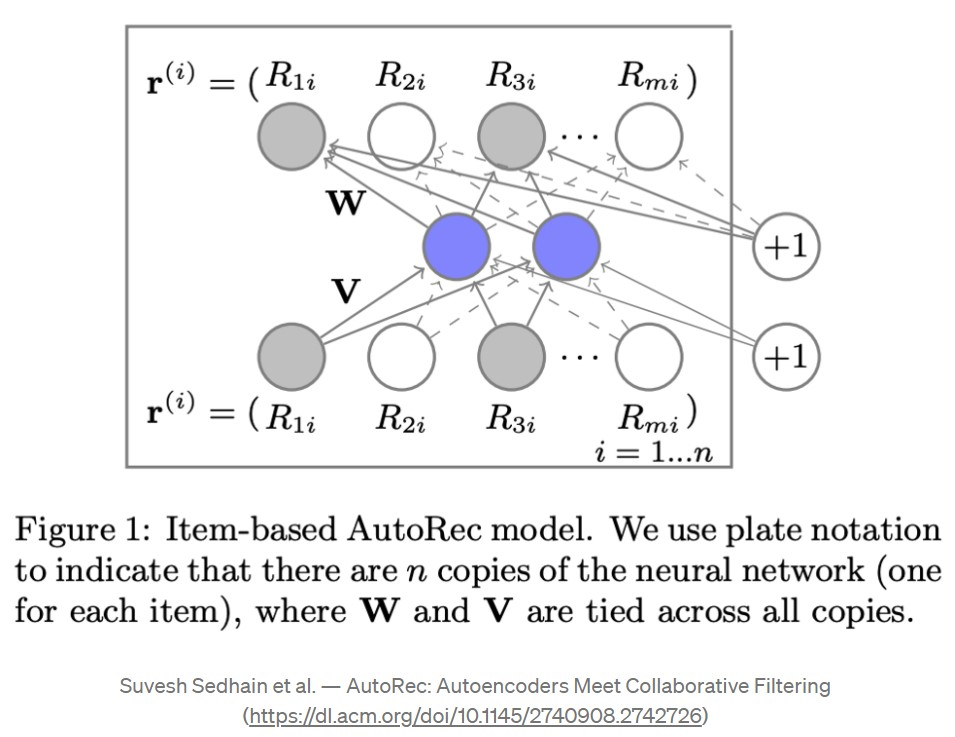
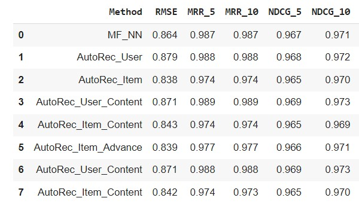

# Recommendation System Course Final Project
Final Project Paper Report in Recommendation System Course (Reichman University)
by Gil Levy and Liad Levi-Raz

This repository includes our report of the paper: AutoRec: Autoencoders Meet Collaborative Filtering
(2015) by Suvash Sedhain, Aditya Krishna Menon, Scott Sanner, Lexing Xie (https://paperswithcode.com/paper/autorec-autoencoders-meet-collaborative)

1. The report document with our analysis and innovations (pdf)
2. Two similar notebooks one with EDA and experiments on MovieLens-100K and the other on MovieLens-1M

## Results

## Running the notebooks

### For the 100K notebook
1. Download the MovieLens 100K dataset https://grouplens.org/datasets/movielens/100k/
2. Extract it to a "datasets/ml-100k" folder next to the notebook (5 folds already provided as part of the dataset archive)

### For the ML-1M notebook
1. Download the MovieLens 1M dataset https://grouplens.org/datasets/movielens/1m/
2. Extract it to a "datasets/ml-1m" folder next to the notebook
3. Get a copy of the "split_rating.sh" (the version we used is from here: https://github.com/tylerwowen/movielens/blob/master/split_ratings.sh), and run it using "bash" in the "datasets" folder to create the 5 folds 
(Note: there is an "official" split_rating.sh script in some of the ML datasets (such as the 10M), however it does not seem to create proper splits, which have a representation of every user from the train fold in the matching test fold)
